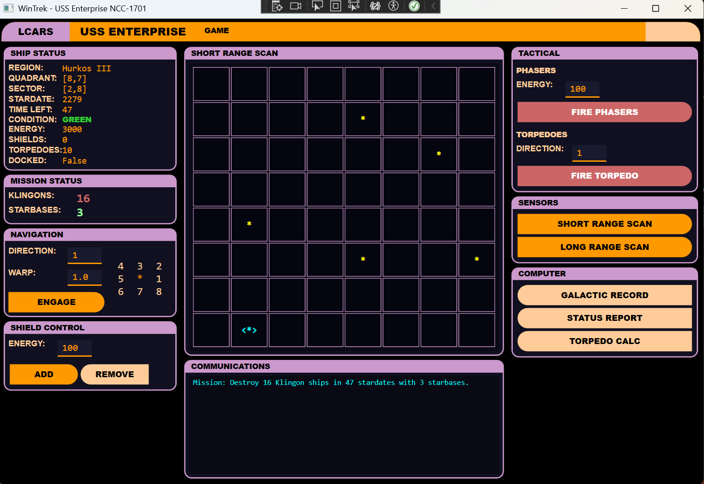

# WinTrek

A modern Windows desktop remake of the classic Star Trek text-based strategy game, built with WPF and .NET 8. Features an LCARS-inspired interface paying homage to Star Trek: The Next Generation's iconic computer displays.



## About the Game

Take command of the USS Enterprise and defend the Federation! Your mission: destroy all Klingon warships within a limited number of stardates. Navigate through an 8x8 galaxy of quadrants, each containing its own 8x8 sector grid. Dock at starbases to replenish energy and repair damage. Use phasers for close combat and photon torpedoes for precision strikes.

### Features

- **LCARS-Style Interface** - Purple and orange themed UI inspired by Star Trek: TNG computer displays
- **Strategic Gameplay** - Manage energy between shields, weapons, and warp drive
- **Galaxy Exploration** - 64 uniquely named quadrants to explore
- **Combat Systems** - Phasers (automatic targeting) and photon torpedoes (manual aiming)
- **Ship Systems** - Damage and repair mechanics for 7 different ship systems
- **Sensor Arrays** - Short-range and long-range scanning capabilities
- **Save/Load** - Save your game progress and continue later

## History

### The Original Star Trek (1971)

The first Star Trek computer game was written by Mike Mayfield in 1971 on a SDS Sigma 7 mainframe at the University of California, Irvine. Inspired by the original Star Trek television series, Mayfield created a text-based tactical game where players commanded the Enterprise through a galaxy filled with Klingon warships.

The game spread rapidly through the early computing community, being ported to countless systems including HP BASIC, various mainframes, and early microcomputers. Its simple yet engaging gameplay made it one of the most widely ported games of the 1970s.

### Super Star Trek (1978)

In 1978, David Ahl and Bob Leedom published an enhanced BASIC version called "Super Star Trek" in *BASIC Computer Games*, one of the first million-selling computer books. This version added features like:

- Named quadrants based on Star Trek lore
- More sophisticated combat mechanics
- Starbase docking and resupply
- Equipment damage and repair
- The iconic sector display format

Super Star Trek became the definitive version, spawning countless adaptations and inspiring generations of programmers to create their own versions.

### DOS Era and Beyond

Throughout the 1980s and 1990s, Star Trek text games continued to evolve on DOS and early Windows systems. Many programmers, learning to code, created their own interpretations - adding graphics, sound, and new features while maintaining the core strategic gameplay.

### WinTrek

This project modernizes a personal DOS-era Star Trek implementation, preserving the classic gameplay while bringing it to modern Windows with a polished graphical interface. The LCARS visual style connects this remake to the broader Star Trek universe while honoring the text-based roots of the original.

## Building

### Requirements

- .NET 8.0 SDK
- Windows 10/11 (WPF is Windows-only)

### Build Commands

```bash
# Clone the repository
git clone https://github.com/geoschmo/WinTrek.git
cd WinTrek

# Restore and build
dotnet build

# Run the game
dotnet run --project src/WinTrek.UI

# Run tests
dotnet test
```

## How to Play

### Objective

Destroy all Klingon ships before time runs out. You have a limited number of stardates to complete your mission.

### Navigation

Use the direction compass to navigate:
```
4  3  2
5  *  1
6  7  8
```
- Enter a direction (1-9, with decimals like 1.5 for between directions)
- Enter warp factor (0.1 to 8.0) - higher = faster but uses more energy
- Warp 1.0 moves you one quadrant

### Combat

**Phasers**
- Automatically target all Klingons in the quadrant
- Damage distributed based on distance
- Enter energy amount to fire

**Photon Torpedoes**
- Manual targeting using direction numbers
- Use the Torpedo Calculator to compute firing solutions
- One-hit kills but limited supply (10 torpedoes)

### Shields

- Transfer energy to shields before combat
- Shields absorb damage from Klingon attacks
- No protection when docked at starbase

### Starbases

- Dock by moving adjacent to a starbase
- Docking replenishes energy and torpedoes
- Repairs all damaged systems
- Provides protection from Klingon attacks

### Ship Systems

Seven systems can be damaged in combat:
- Warp Engines
- Short Range Scanner
- Long Range Scanner
- Shield Control
- Main Computer
- Photon Torpedo Control
- Phasers

Damaged systems have reduced functionality until repaired.

## Project Structure

```
WinTrek/
├── src/
│   ├── WinTrek.Core/        # Game engine (no UI dependencies)
│   │   ├── Models/          # Domain entities
│   │   ├── Services/        # Game logic
│   │   ├── Events/          # Game events
│   │   └── Enums/           # Game enumerations
│   │
│   └── WinTrek.UI/          # WPF application
│       ├── ViewModels/      # MVVM view models
│       ├── Views/           # Dialog windows
│       ├── Converters/      # Value converters
│       └── Themes/          # LCARS styling
│
└── tests/
    └── WinTrek.Core.Tests/  # Unit tests
```

## Acknowledgments

- **Mike Mayfield** - Creator of the original Star Trek game (1971)
- **David Ahl & Bob Leedom** - Super Star Trek (1978)
- **Gene Roddenberry** - Creator of Star Trek
- **Michael Okuda** - Designer of the LCARS interface for Star Trek: TNG

## License

This is a fan project created for educational purposes. Star Trek and related marks are trademarks of Paramount Pictures / CBS Studios.
